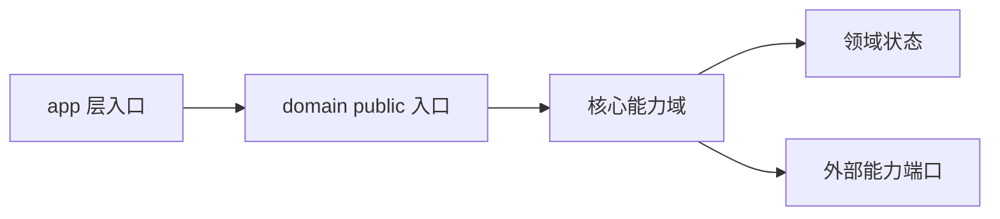

# Domain 核心能力设计

本文是当前项目正式的 domain 核心能力设计。它描述业务能力、数据主线、状态生命周期和 app/domain 边界，不记录临时代码结构。

复制母版后，必须用真实业务替换本文占位内容；没有定稿前保持 `status: draft`。

## 元数据

- status: draft
- owner:
- updated-at:
- source-track:

## 设计目标

- 目标 1：
- 目标 2：
- 明确不做：

## 能力域总览

| 能力域 | 提供的稳定业务能力 | 调用方 | 输入 | 输出 | 是否持有状态 |
| --- | --- | --- | --- | --- | --- |
| CAP-001 |  |  |  |  |  |

## 模块关系图

## public 入口

| public 入口 | 调用方 | 业务语义 | 为什么不更粗 | 为什么不更细 |
| --- | --- | --- | --- | --- |
|  |  |  |  |  |

## 数据主线

| 阶段 | 数据对象 | 所属层 | 语义 | 是否正式状态 |
| --- | --- | --- | --- | --- |
| 输入 |  |  |  |  |
| 规范事实层 |  |  |  |  |
| 派生结果 |  |  |  |  |
| 查询投影 |  |  |  |  |

## 状态所有权与生命周期

| 状态 | 所有者 | 创建时机 | 更新规则 | 重建方式 | 失效 / 清理 |
| --- | --- | --- | --- | --- | --- |
|  |  |  |  |  |  |

## 外部端口

| 领域需要的能力 | 端口 | 适配器 | 失败语义 | fake / mock 策略 |
| --- | --- | --- | --- | --- |
|  |  |  |  |  |

## 错误、降级与回滚

| 场景 | domain 行为 | app 行为 | 是否可重试 | 是否影响正式状态 |
| --- | --- | --- | --- | --- |
|  |  |  |  |  |

## 设计约束

- domain 不直接依赖 infra、SDK、数据库、缓存、消息队列客户端。
- app 不按固定顺序组合多个 domain 内部 helper 来完成一个业务用例。
- public API 面积必须少于或等于真实业务概念数量，新增 public 类型需在 Design 中解释。
- 当前实现偏差记录在 `context/architecture/implementation-module-map.md`，不得用实现快照替代正式设计。

## 待确认问题

| 问题 | 当前假设 | 风险 | 确认人 | 阻塞级别 |
| --- | --- | --- | --- | --- |
|  |  |  |  | Blocking / Non-blocking |
