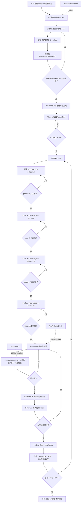

# Harness 目录

本目录保存工程控制系统。根目录只保留本导航文件，具体规则和工具按职责放入子目录。

工具接入配置位于工程根目录：

- `.claude/settings.json`：Claude Code Hooks。
- `.codex/config.toml`：Codex Hooks。
- `.claude/agents/`：Claude Code 角色 wrapper。
- `.codex/agents/`：Codex 角色 wrapper。

Hooks 配置都调用 `harness/scripts/hooks/harness_gate.py`，把 SOP 变成会话启动、编辑前、结束前的机械化护栏。角色 wrapper 统一指向 `harness/agents/*.md`，避免 Claude Code 和 Codex 各维护一套角色说明。

## 控制流程图



这张图只表达控制流。业务服务的目录蓝图、分层规则和代码脚手架不放在 `harness/`，它们属于项目上下文。

| 目录 | 用途 |
| --- | --- |
| `sop/` | 可执行操作手册 |
| `state/` | 初始化状态、active track 等脚本读写的运行状态 |
| `lifecycle/` | Track 生命周期和全局门禁 |
| `scripts/` | 按触发方式分组的 Harness 脚本：hooks / lifecycle / verify / tools |
| `agents/` | Agent 分工 |
| `dry-runs/` | 真实需求试运行日志 |

## 关键文件

- `state/init-status.md` — 工程初始化状态门禁。复制母版后默认 `未完成`，初始化未完成时阻断 Track 创建和业务代码编辑。
- `state/active-track.md` — 当前 active track 本地指针（已 `.gitignore`，由 `track.py` 维护）。同时仅允许 1 个 active track。
- `lifecycle/track-lifecycle.md` — Track 状态机、命令、active-track.md 格式、互斥规则。
- `sop/01-新服务初始化SOP.md` — 新服务初始化操作手册（15 节，每节带完成证据三类型）。
- `sop/02-domain-clarification-sop.md` — 可选 domain 澄清流程，用于先定核心能力设计。
- `sop/03-domain-special-verification-sop.md` — 可选 domain 专项验证流程，用于高风险规则的长期正确性和性能验证。
- `scripts/hooks/harness_gate.py` — 工具 Hook 调用的门禁脚本（SessionStart / PreToolUse / Stop 三阶段，含 active-track 锁）。
- `scripts/lifecycle/check-init-readiness.py` — 初始化完成度自动检查（README/AGENTS/CLAUDE/constitution/context/scripts/Hooks/门禁行为）。
- `scripts/lifecycle/check-spec-coverage.py` — Spec 不变式和业务规则覆盖检查。
- `scripts/lifecycle/track.py` — Track 生命周期命令（open / next-stage / revise-stage / finish-task / close / pre-merge-check / status）。finish-task 默认只验证并更新状态；commit / push 必须人工显式确认。
- `verification/` — 可选专项验证资产，默认不强制启用。
- `verification-runs/` — 可选专项验证运行记录。
- `scripts/verify/` — CI / PR / 完成前验证入口。
- `scripts/tools/` — 手动修复和本地辅助工具。
- `agents/*.md` — 5 个角色定义（planner / generator / evaluator / reviewer / maintainer），工具无关；Claude Code 和 Codex 都通过 `.claude/agents/` 和 `.codex/agents/` 下的 wrapper 触发。

业务服务的目录蓝图、分层规则和代码脚手架不放在 `harness/`。它们属于项目上下文：

- `context/architecture/blueprint/` — 业务服务目录、分层、依赖边界。
- `context/engineering/scaffolds/` — AI 可复制改造的代码脚手架。

常用入口：

```bash
python3 -B harness/scripts/lifecycle/check-init-readiness.py
python3 -B harness/scripts/hooks/harness_gate.py prompt
bash harness/scripts/verify/verify-template.sh
```

初始化状态见 `harness/state/init-status.md`。初始化未完成前，不创建需求 Track，不修改业务代码。
