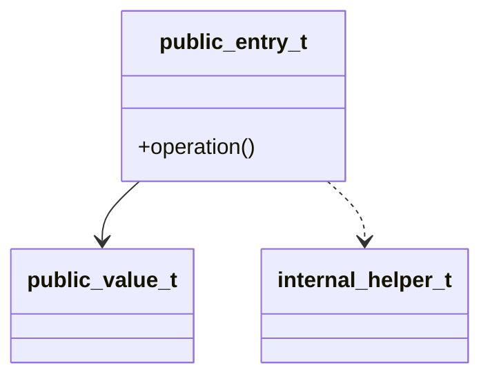

# Design：需求名称

> 本档是 Track 的"怎么做"。spec 必须先有 `approved-by` 才允许编辑本档。design 没有 `approved-by` 之前禁止编辑 `tasks.md`。

## 定稿戳

- approved-by:
- approved-at:

## 方案摘要

### 推荐方案

### 选择原因

### 不采用方案及原因

| 方案 | 不采用原因 | 风险 |
| --- | --- | --- |

## 分层影响

| 层级 | 文件 / 模块 | 影响 |
| --- | --- | --- |
| domain |  |  |
| ports |  |  |
| adapter |  |  |
| infra |  |  |
| app |  |  |
| observer |  |  |

## 端口与适配器映射

| 领域需要的能力 | 端口 | 适配器 | 基础设施实现 | 测试 fake/mock |
| --- | --- | --- | --- | --- |

## 接口设计

> "接口签名"一栏可贴不超过 6 行的头文件片段或伪代码。
> "命中 INV"必填，引用 spec 的不变式 ID；缺失说明这条接口不该存在。

| 接口签名（<= 6 行） | 入参 | 出参 | 关键状态字段 | 命中 INV | 关键不变式 | 关键时序 | 错误处理 | 幂等性 |
| --- | --- | --- | --- | --- | --- | --- | --- | --- |
|  |  |  |  |  |  |  |  |  |

## 类图 / 模块关系

> 必须说明 public 入口、public 值对象、internal helper、调用方向。
> 新增 public 类型超过 3 个时，必须说明为什么不提供更粗粒度的聚合入口。



### 拆分粒度说明

| 类 / 模块 | public / internal | 调用方 | 为什么独立存在 | 为什么不合并 | 为什么不继续拆 |
| --- | --- | --- | --- | --- | --- |
|  |  |  |  |  |  |

## 关键算法 / 状态机 / 时序

> 高风险模块（去重、合流、状态机、时间窗、重采样、计费、权限、资金、库存等）必填一段不超过 30 行的伪代码、状态机或时序图。
> 不允许用"详见实现"一句话带过。

### 模块 A：模块名

- 命中 INV：
- 形式：伪代码 / 状态机表 / 时序图

```text
（贴 <= 30 行伪代码或状态机；时序图可用 ASCII 或 mermaid）
```

## 流程设计

### 主流程

### 异常流程

| 类别 | 触发条件 | 系统行为 | 命中 INV |
| --- | --- | --- | --- |
| 中间件错误 |  |  |  |
| 业务正常态 |  |  |  |
| 容量与背压 |  |  |  |

### 回滚

### 降级

## 数据与状态

- 新增状态：
- 缓存 / 存储影响：
- 并发和生命周期：

## 验证方案

| 验证项 | 命令 / 方法 | 通过标准 | 命中 INV |
| --- | --- | --- | --- |
|  |  |  |  |

## Spec-Design 对齐 Checklist

- [ ] 覆盖所有 Spec 业务规则（命中 RULE-ID）。
- [ ] 覆盖所有 Spec 业务不变式（命中 INV-ID）。
- [ ] 覆盖所有错误路径。
- [ ] 未引入 Spec 外范围。
- [ ] 外部依赖可 fake/mock。
- [ ] 回滚和降级可执行。
- [ ] 高风险模块的关键算法 / 状态机 / 时序段非占位。

## 知识引用

| 知识 ID | 标题 | 使用位置 |
| --- | --- | --- |

## 定稿要求

- [ ] 接口设计表所有行都填了"命中 INV"与"关键不变式"。
- [ ] 类图 / 模块关系图能看出 public 入口、值对象、internal helper 和调用方向。
- [ ] 每个新增 public 类型都填写了拆分粒度说明。
- [ ] 新增 public 类型超过 3 个时，已说明聚合入口取舍。
- [ ] 高风险 Track 至少 1 个"关键算法 / 状态机 / 时序"模块给出非占位内容。
- [ ] 验证方案每行都标了命中 INV。
- 全部勾选后，在"定稿戳"补 `approved-by` / `approved-at`，再走下一档。
